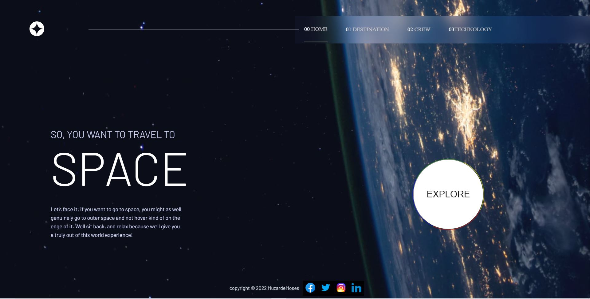

# Frontend Mentor - Space tourism website solution

This is a solution to the [Space tourism website challenge on Frontend Mentor](https://www.frontendmentor.io/challenges/space-tourism-multipage-website-gRWj1URZ3). Frontend Mentor challenges help you improve your coding skills by building realistic projects.

## Table of contents

- [Overview](#overview)
- [The challenge](#the-challenge)
- [Screenshot](#screenshot)
- [Links](#links)
- [My process](#my-process)
- [Built with](#built-with)
- [What I learned](#what-i-learned)
- [Continued development](#continued-development)
- [Author](#author)
- [Acknowledgments](#acknowledgments)

**Note: Delete this note and update the table of contents based on what sections you keep.**

## Overview

### The challenge

Users should be able to:

- View the optimal layout for each of the website's pages depending on their device's screen size
- See hover states for all interactive elements on the page
- View each page and be able to toggle between the tabs to see new information

### Screenshot



### Links

- Solution URL: [Add solution URL here](https://your-solution-url.com)
- Live Site URL: [Add live site URL here](https://spacetourism.mosesadebayo.me/)

## My process

### Built with

- Semantic HTML5 markup
- CSS custom properties
- Flexbox
- Mobile-first workflow
- [React](https://reactjs.org/) - JS library

### What I learned

```html
<h1>Some HTML code I'm proud of 🎉</h1>
```

```css
.proud-of-this-css {
	color: papayawhip;
}
```

```js
const [isMenuOpen, setIsMenuOpen] = useState(false);

const handleClick = () => {
	const navLinks = document.querySelector(".nav-links");
	navLinks.classList.toggle("open");
	const linkItems = document.querySelectorAll(".link-item");

	linkItems.forEach((item) =>
		item.addEventListener("click", () => navLinks.classList.remove("open"))
	);

	setIsMenuOpen((prev) => !prev);
};
```

### Continued development

I will continue to develope my css skills especially in  positioning areas and media queries to make my websites more responsive.

I will also learn more on React

## Author

- GitHub - [@MuzardeMoses](https://github.com/MuzardeMoses)
- Frontend Mentor - [@muzardemoses](https://www.frontendmentor.io/profile/muzardemoses)
- Twitter - [@Muzarde1](https://www.twitter.com/Muzarde1)
- LinkedIn - [Moses Adebayo](https://www.linkedin.com/in/muzardemoses/)
- Instagram - [@muzardemoses](https://www.instagram.com/ademuzardemoses/)
- Facebook - [Adebayo MuzardeMoses Olaoluwa ](https://facebook.com/ademuzardemoses)
- YouTube - [MuzardeMoses](https://www.youtube.com/channel/UCg4W7cbWu6dW_8oJEHWaP9w)


## Acknowledgments

I would like to thank [Richard Adebayo](https://www.linkedin.com/in/richardebrain/) and [Samuel Adebayo](https://www.linkedin.com/in/sambayo/) for their support and encouragement.

I would also like to thank [Frontend Mentor](https://www.frontendmentor.io/) for the opportunity to learn and improve my skills.


